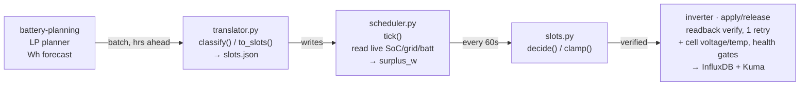
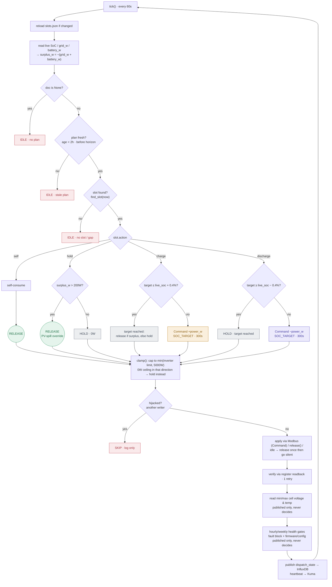
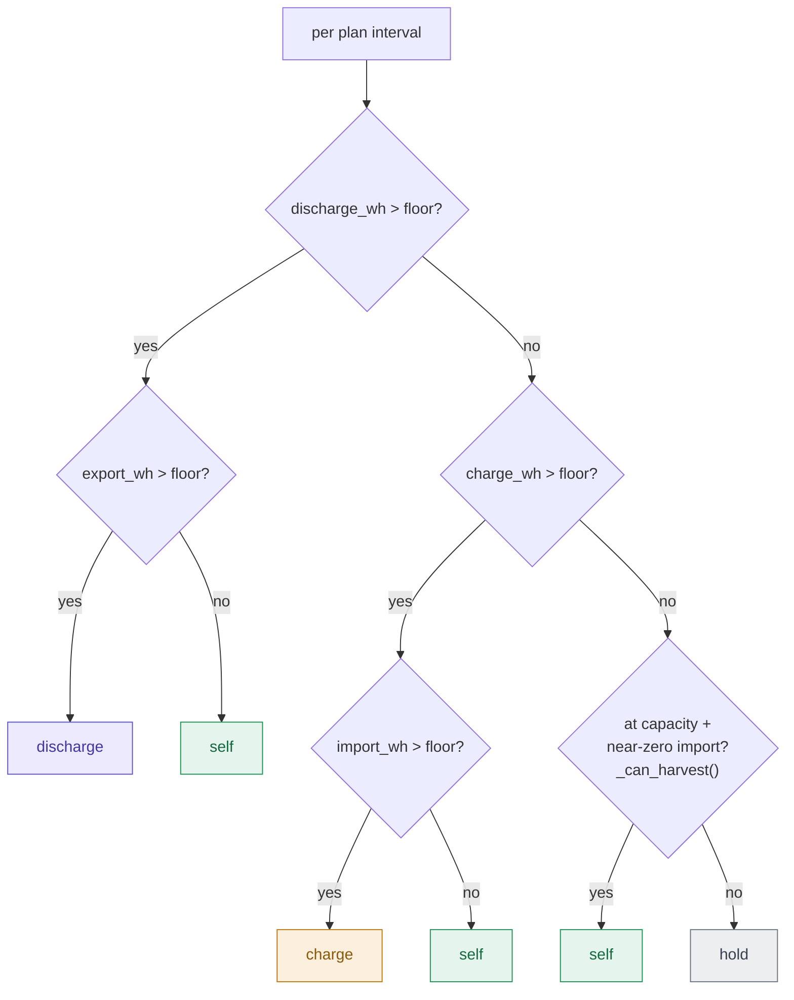

# Dispatch decision flow

How a planner forecast becomes a live inverter command. Two clocks run this system: a batch
planning run (external LP solver, hours ahead) and a live loop that polls the inverter once a
minute and only ever acts on the current slot. See `DESIGN-dispatch.md` for narrative context;
this doc is the visual reference for the control flow itself.

## Pipeline overview

`dispatch/plan.py` → `dispatch/translator.py` → `dispatch/slots.json` → `dispatch/scheduler.py`
→ `dispatch/slots.py` → Modbus register write.

## Live decision: `decide()`

Runs on every 60s tick (`dispatch/slots.py:231-323`, driven by `dispatch/scheduler.py:310-579`).
Re-validates the plan's chosen action against the *live* state of charge before anything reaches
the inverter — a planned charge/discharge is downgraded to hold once the target is within a
0.4% deadband of live SoC.

`dispatch/slots.py:231-323` (decide) and `:326-367` (clamp). The charge/discharge "target
reached" outcomes release if `surplus_w > 0`, else hold.

## Planning-time classification: `classify()`

Upstream of the above — runs once per planner batch, not per tick. `translator.py` turns each
LP interval's Wh forecast into the `slot.action` that `decide()` later re-checks live.

`dispatch/translator.py:156-189` (classify) and `:90-153` (`_can_harvest` — the at-capacity
PV-surplus override). `to_slots()` (`:192-287`) then converts the action to `power_w`/
`target_soc` and downgrades charge/discharge to hold if the target doesn't actually move away
from the interval's own start-of-interval SoC.

On a `discharge` action, `power_w` normally derives from `discharge_wh × 60/minutes`, but
`to_slots()` (`:217-226`) uses `iv.discharge_power_w` instead whenever the plan supplies one.
`Marstek-planning.py` sets that field only on intervals it planned at the discharge ceiling
(`maxDischargeSpeed`), to a setpoint (`maxRequestedDischargeSpeed`, currently 5000 W) above
what `discharge_wh` alone implies — the inverter delivers roughly 300 W less than a sustained
discharge setpoint asks for (investigated 2026-08-24), so reaching the true achievable ceiling
requires commanding above it. `discharge_wh`/`soc_wh` themselves are never touched — only the
wire setpoint for that one interval changes. Not done for `charge`: measured charge sessions
already meet or exceed their setpoint, so there is nothing to compensate for (yet).

## File map

| File | Role |
|---|---|
| `dispatch/plan.py` | Parses the LP planner's raw output. |
| `dispatch/translator.py` | `classify()` + `to_slots()` + `build_document()` → writes `slots.json`. |
| `dispatch/slots.py` | `decide()` and `clamp()` — the pure decision function this doc mostly diagrams. |
| `dispatch/scheduler.py` | `tick()` — the 60s loop: read live state, call decide/clamp, actuate, verify, publish. |
| `dispatch/registers.py` | `Command`, `DispatchMode`, Modbus register encode/decode. |
| `dispatch/slot_publisher.py`, `state.py` | Publishing helpers for slots.json state and `dispatch_state`. |
