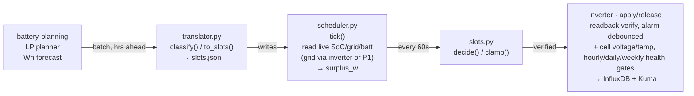
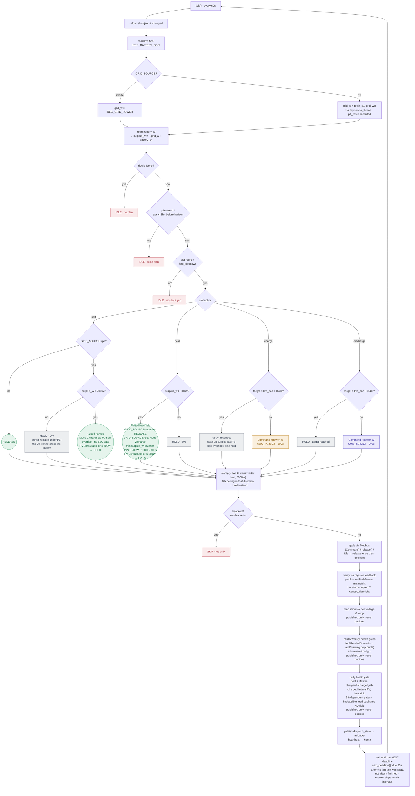
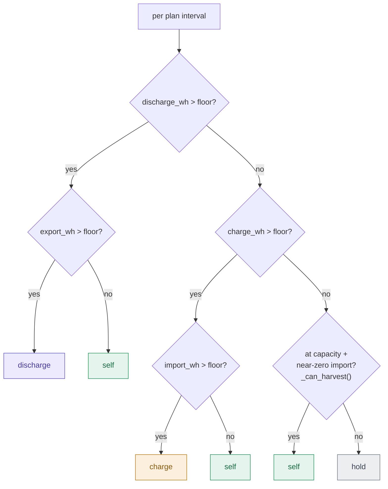

# Dispatch decision flow

How a planner forecast becomes a live inverter command. Two clocks run this system: a batch
planning run (external LP solver, hours ahead) and a live loop that polls the inverter once a
minute and only ever acts on the current slot. See `DESIGN-dispatch.md` for narrative context;
this doc is the visual reference for the control flow itself.

## Pipeline overview

`dispatch/plan.py` → `dispatch/translator.py` → `dispatch/slots.json` → `dispatch/scheduler.py`
→ `dispatch/slots.py` → Modbus register write.

## Live decision: `decide()`

Runs on every 60s tick (`slots.decide()`, driven by `scheduler.tick()`).
Re-validates the plan's chosen action against the *live* state of charge before anything reaches
the inverter — a planned charge/discharge is downgraded to hold once the target is within a
0.4% deadband of live SoC.

`slots.decide()` and `slots.clamp()`. A charge slot whose target is
already reached soaks up surplus when `surplus_w > SURPLUS_HARVEST_W` (200 W, strictly greater),
else holds. A discharge slot whose target is already reached always holds: surplus does not
rescue it.

**How the PV-spill override soaks up surplus depends on `GRID_SOURCE`** (`slots._harvest`,
`decide(harvest_by_command=...)`, passed by `tick()` as `GRID_SOURCE == "p1"`). With `inverter`
it releases: the inverter's own CT measured the surplus, so its self-consumption can see it.
With `p1` it commands instead, a Mode 2 (`SOC_TARGET`) charge at `surplus_w - HARVEST_MARGIN_W`
(200 W), target 100%, 300s, clamped like any charge. A release there is a no-op, because the
inverter's CT reads one phase of three and sees no export while P1 shows several hundred watts
(measured 2026-09-24: P1 surplus 300-520 W, battery 0 W, inverter app showing 84 W importing).
Mode 1 (PV-only) was tried first and also delivered 0 W, because it judges PV by the same blind
CT (measured 2026-09-24 11:29Z). Mode 2 delivers regardless, so it CAN import: a PV drop inside
a tick is bought from the grid until the next tick re-sizes it, and the 200 W margin absorbs
ordinary ripple. The setpoint is capped at the inverter's own PV meter (`REG_PV_METER`, read
only under P1): because the surplus is invariant to battery action, a frozen or misdirected P1
reading would otherwise re-arm a grid-fed charge every tick, night included, with the loop alive
so the dead man's switch never fires. An unreadable or implausible PV reading, or a cap that
leaves no setpoint above 0 W, holds. The surplus identity is invariant to battery action, so the command does not
oscillate. A plan `self` slot takes the same Mode 2 harvest under P1 when `surplus_w > 200 W`:
its release absorbed nothing and worse, the blind CT had the battery discharging into the export
(measured 2026-09-24 14:55Z: exporting at full PV, SoC falling 97.2 → 96.8%). Self-consumption
would have charged from that surplus, so this carries out the plan rather than overriding it.
There is no SoC gate, because the gauge reads 100% while the pack still takes kWh. A refused
harvest there (PV unreadable or too low) holds, like the other two, because a release during an
export is exactly the discharge risk. **With no surplus a `self` slot under P1 holds at 0 W
too, so no P1 path releases.** The inverter's CT does not see the inverter's own power, so its
self-consumption loop never closes and runs the battery at full power in whichever direction the
CT leans (measured 2026-09-25, inverter left to itself before sunrise: battery charging at
4.8 kW, P1 importing 5.05 kW, the CT a flat −80 W "export"). The hold costs the house load from
the grid; the release it replaces could cost a full-power grid charge or discharge. With
`GRID_SOURCE=inverter` a `self` slot still releases. A failed P1 fetch sets `surplus_w = None`
(no fallback to the inverter's grid register), which holds. In the met-charge-target case the
command's 100% target overrides the plan's own ceiling: a plan that stopped at 62% now keeps
charging from PV.

**Magnitude shortfall check** (`tick()`, before `decide()`; logs and publishes, never decides).
Live only. It scores the PREVIOUS tick's command against the battery power read this tick.
Only Mode 2 (`SOC_TARGET`) commands are scored, against their setpoint; that includes the P1
harvest, so a harvest delivering nothing is flagged. Not scored once live SoC is within the 0.4%
deadband of the command's target (the inverter stops at the ENCODED target, 0.4% steps, a tick
before the deadband hands the slot over), nor when live SoC is unreadable. A shortfall is
flagged at `>= 200 W` and `>= 5%` short, logged once on entry and once on clearing.

`GRID_SOURCE` (env var, default `inverter`) swaps where `grid_w` for the surplus calc comes
from: the inverter's own `REG_GRID_POWER` register, or (`GRID_SOURCE=p1`) a P1 energy monitor's
local API via `scheduler.fetch_p1_grid_w()`. `tick()` still `await`s this call before reading
`battery_w`, so a slow P1 response DOES still delay this tick's own critical path by up to the
fetch's timeout — `asyncio.to_thread` does not change that. What it protects is the event loop
as a whole: other concurrently-scheduled coroutines (heartbeat writes, SIGTERM handling) keep
running while the blocking HTTP call is parked on a worker thread, instead of the whole process
stalling on it. This exists because the inverter's grid CT only sees one phase on a house wired
for three — see `docs/superpowers/specs/2026-09-23-p1-grid-source-design.md`. Either source
feeds the same `IMPLAUSIBLE_POWER_W` guard and the same `None`-on-failure fallback (a bad read
or an implausible value sets `surplus_w = None`, which `decide()` treats as "unknown", not
zero — not drawn as its own box above, but the same short-circuit either grid source hits on
failure). The P1 fetch's own success/failure is recorded separately as `cache["p1_result"]`
(`(True, "OK")` / `(False, reason)` / `None` when `GRID_SOURCE != "p1"`), for `monitor_pings()`
to report on.

The loop's period is the interval, not the interval plus the work (`scheduler.next_deadline`).
The tick talks to an inverter and to Kuma, so sleeping a flat 60s after it re-times the loop by
however slow those are: one unroutable heartbeat URL held `urlopen` for its 5s timeout every
tick and the loop ran at 65s (measured 2026-08-30), losing a tick every twelve minutes without
tripping anything — the dead man's switch is 5x the interval and absorbed it. An overrunning
tick skips whole intervals rather than firing back-to-back to catch up, because a burst of
Modbus writes into an inverter already too slow to answer is the failure feeding itself.

The margin that buys is **three missed ticks, not four**, though the 5x ratio between
`REFRESH_INTERVAL_S` and `DISPATCH_DURATION_S` reads like four. Every commanding tick re-arms
the switch, so a command written at t0 has its next write due at t0 + (missed+1)x60: t0+240
after three misses, t0+300 after four — the expiry instant itself, and past it in practice
because the write ends a tick that reads the inverter first. Past three, the inverter reverts
to self-consumption on its own and the next command starts from a released battery.

## Planning-time classification: `classify()`

Upstream of the above — runs once per planner batch, not per tick. `translator.py` turns each
LP interval's Wh forecast into the `slot.action` that `decide()` later re-checks live.

`dispatch/translator.py:156-189` (classify) and `:90-153` (`_can_harvest` — the at-capacity
PV-surplus override). `to_slots()` (`:192-287`) then converts the action to `power_w`/
`target_soc` and downgrades charge/discharge to hold if the target doesn't actually move away
from the interval's own start-of-interval SoC.

On a `discharge` action, `power_w` normally derives from `discharge_wh × 60/minutes`, but
`to_slots()` (`:217-226`) uses `iv.discharge_power_w` instead whenever the plan supplies one.
`Marstek-planning.py` sets that field only on intervals it planned at the discharge ceiling
(`maxDischargeSpeed`), to a setpoint (`maxRequestedDischargeSpeed`, currently 5000 W) above
what `discharge_wh` alone implies — the inverter delivers roughly 300 W less than a sustained
discharge setpoint asks for (investigated 2026-08-24), so reaching the true achievable ceiling
requires commanding above it. `discharge_wh`/`soc_wh` themselves are never touched — only the
wire setpoint for that one interval changes. Not done for `charge`: measured charge sessions
already meet or exceed their setpoint, so there is nothing to compensate for (yet).

## File map

| File | Role |
|---|---|
| `dispatch/plan.py` | Parses the LP planner's raw output. |
| `dispatch/translator.py` | `classify()` + `to_slots()` + `build_document()` → writes `slots.json`. |
| `dispatch/slots.py` | `decide()` and `clamp()` — the pure decision function this doc mostly diagrams. |
| `dispatch/scheduler.py` | `tick()` — the 60s loop: read live state, call decide/clamp, actuate, verify, publish. |
| `dispatch/registers.py` | `Command`, `DispatchMode`, Modbus register encode/decode. |
| `dispatch/slot_publisher.py`, `state.py` | Publishing helpers for slots.json state and `dispatch_state`. |
