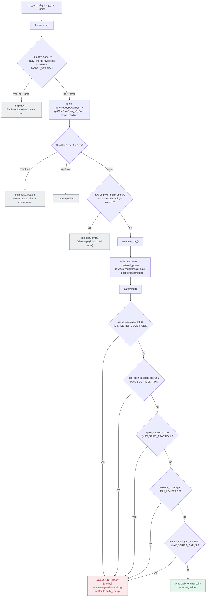
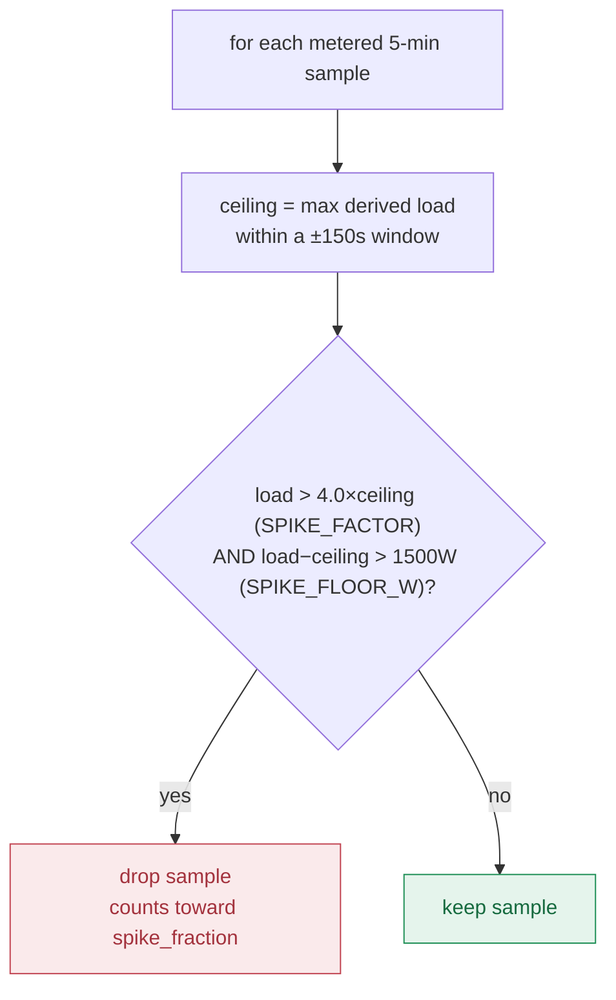

# Efficiency reconciliation flow

How `collector/efficiency.py` turns a day's raw AlphaESS history into a trusted
`daily_energy` row — or decides the day isn't trustworthy enough to write.

## Per-day orchestration: `run_influx()` / `process_day()`

Gate order matters: series coverage is checked first because a thin series would otherwise
flatteringly understate loss; SoC-clock alignment is checked before the gap check because
clock skew, not data thinness, is the more common real cause of a bad day.

## Spike rejection inside `compute_day()`: `drop_implausible()`

The one true per-sample decision inside metric derivation — everything else in `compute_day()`
(coverage, alignment, kWh integration) is straight-line computation, not branching.

## Derived metrics (`compute_day`, no branching)

| Metric | Formula |
|---|---|
| `conversion_loss_kwh` | `derived_load_kwh − metered_load_kwh` |
| `charge_minus_discharge_kwh` | `charge_kwh − discharge_kwh` (uncorrected) |
| `delta_soc_percent` | `readings[-1].soc − readings[0].soc` |
| `battery_loss_kwh`* | `charge_kwh − discharge_kwh − delta_soc_kwh` |
| `total_loss_kwh`* | `conversion_loss_kwh + battery_loss_kwh` |

\* only computed when `BATTERY_CAPACITY_KWH` is set.

## Other entry points

| Command | Function | Effect |
|---|---|---|
| (default) | `run_influx()` | main write path above; pushes a heartbeat unless `--dry-run` |
| `--check-alignment` | `run_check_alignment(days)` | sweeps clock offsets −3h..+3h in 5-min steps, reports the offset minimizing SoC disagreement — diagnoses uploadTime timezone bugs. Read-only. |
| `--system-facts` | `run_system_facts()` | logs inverter/battery/capacity from `getEssList`; warns if `BATTERY_CAPACITY_KWH` drifts &gt;1% from reported `cobat`. Read-only. |

## File map

| File | Role |
|---|---|
| `collector/efficiency.py` | `compute_day()`, `gate()`, `process_day()`, `run_influx()`, `drop_implausible()`, `_already_done()`, alignment/system-facts subcommands. |
