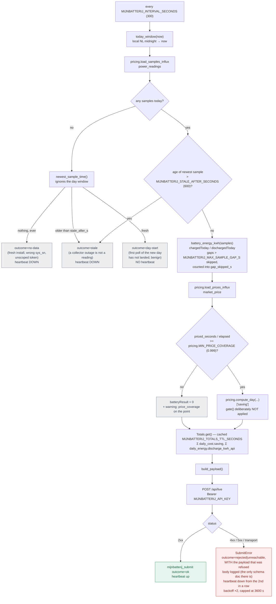

# mijnbatterij.nl submission flow

How one InfluxDB read becomes one public leaderboard row: what is refused, what is
sent, and which two fields are guesses about an undocumented API rather than
measurements. See DEPLOY.md, "Publishing to mijnbatterij.nl" for the operator's
side of this.

The service (`collector/mijnbatterij.py`) reads only InfluxDB. It never calls the
AlphaESS API, so it cannot perturb collection and adds nothing to the shared
`appId` rate budget.

## One submission cycle: `collect()` then `submit()`

Two refusals, both silent-failure guards rather than errors: a stale sample would
be published as live, and a missing price feed would be published as a real
€0.00 rather than an unknown one.

## Where each field comes from

| Payload field | Source | Note |
|---|---|---|
| `timestamp` | newest `power_readings` sample | the measurement's time, never the submission's |
| `batteryCharge` | `soc_percent` | |
| `batteryPower` | `battery_power_w` | **sign flipped by default.** AlphaESS `pbat` is + while discharging; sent charge-positive unless `MIJNBATTERIJ_CHARGE_POSITIVE=0` |
| `chargedToday` / `dischargedToday` | `battery_power_w` integrated from local midnight | via `pricing._accumulate`, so an interval that crosses zero lands in both totals instead of netting; gaps beyond `MIJNBATTERIJ_MAX_SAMPLE_GAP_S` are skipped, never interpolated |
| `batteryResult` | `pricing.compute_day()['saving']` over today so far | the same two-world model `daily_cost` stores, ungated |
| `batteryResultTotal` | Σ stored `daily_cost.saving` at the current `model_version`, + today | |
| `totalBatteryCycles` | (Σ `daily_energy.discharge_kwh_api` + today) / `BATTERY_CAPACITY_KWH` + `MIJNBATTERIJ_CYCLES_OFFSET` | throughput-equivalent, not an event count |
| `mode` | `MIJNBATTERIJ_MODE` | **omitted when blank, which is the default.** The profile's own Modus field (`Handmatig/doe-het-zelf`) already says it; a sent mode is validated against the Aansturing provider's unpublished set |
| `loadBalancingActive` | `MIJNBATTERIJ_LOAD_BALANCING` | nothing in this stack does load balancing |

## Why `gate()` is not applied to today

`pricing.gate()` decides whether a day is trustworthy enough to **store
permanently** in `daily_cost`, and by construction a partial day fails its
coverage check — so applying it here would mean never submitting a euro figure at
all.

The bargain is different for a live value: today's number self-corrects on the
next cycle, five minutes later, and is superseded outright by the gated
`daily_cost` row tomorrow night. It is the same *model* either way, which is what
matters — a separate intraday model would make the platform's daily total step at
midnight by the difference between the two.

## Two known under-counts in `batteryResultTotal`

Both are deliberate: the total under-states rather than estimating.

- A day rejected by `pricing.gate()` is absent from `daily_cost` forever, and so
  from this sum. Filling it with an estimate would put a number on a public
  leaderboard that no stored row can ever be reconciled against.
- Yesterday is missing until `daily-savings.sh` runs (~02:00), so the total dips
  for the first couple of hours of each local day and then recovers.

## Why an outage is not a "successful" cycle

`collect()` returning nothing is not an error — no exception is raised, and the
next cycle may well succeed. It is also not a success, and the distinction is
the whole reason the heartbeat exists: a dead collector means every cycle
completes cleanly while nothing reaches the platform for hours. So a `None`
snapshot pushes the heartbeat **down** with its outcome as the reason, and does
**not** count as a consecutive failure — backing off would not help, because the
fault is upstream of this service, and retrying costs one cheap query.

The outcomes are kept apart on the point because they are fixed in different
places: `no-data` is a wrong `sys_sn`, an unscoped token or a fresh install;
`stale` is a collector outage; `day-start` is neither.

**The verdict comes from the newest sample anywhere, not from today's window.**
A collector that died at 22:00 and stayed dead leaves today's window empty from
midnight onwards, so a verdict drawn from that window alone would say "no data
at all" — inverting the diagnostic at precisely the moment the outage is
longest. `newest_sample_time()` looks past the window to decide.

`day-start` covers the ~30 s between the local midnight and the day's first
poll, where the window is empty and the collector is perfectly healthy. On a
300 s cycle that is hit about once every ten days; treating it as a fault would
be one false alarm a fortnight, so it pushes no heartbeat at all.

A cycle that raises writes an `error` point too, and pushes down from the second
in a row. That is where an unreachable InfluxDB lands — `collect()` raises
before there is anything to submit — and without a row the panel shows a gap
indistinguishable from the container not running.

## Why the price feed is checked for coverage, not presence

`integrate_by_interval` silently drops energy in an interval it has no price
for. So a feed that stopped at 08:00 does not fail loudly at 20:00: it returns
eight hours of saving for a twenty-hour day, and that number is entirely
plausible.

`pricing.MIN_PRICE_COVERAGE` is the gate that exists for this, and it is the one
gate check a partial day does **not** fail by construction — day-ahead prices
are published a day in advance, so the elapsed part of today should be fully
priced or something is broken upstream. Below it, `batteryResult` is sent as 0
with a warning rather than as a fraction of the truth, and `price_coverage` goes
onto the status point so that zero can be told from a genuinely break-even day.

## Why the trapezoid stops at a gap

`battery_energy_kwh()` skips any sample pair more than
`MIJNBATTERIJ_MAX_SAMPLE_GAP_S` apart (default 3× the poll interval — the same
line `pricing.compute_day()` draws between cadence drift and a real outage).

The trapezoid assumes power ramped between two samples. True across 30 s; a
fabrication across an outage — six hours missing with the battery charging at
4 kW either side invents about 24 kWh of `chargedToday`. `compute_day()` has the
same shape and survives it only because `gate()`'s max-gap check discards the
whole day afterwards. There is no equivalent second line of defence here: a live
figure is published the moment it is computed. Skipping under-reports instead,
which is the direction that cannot invent energy, and `gap_skipped_s` on the
status point says by how much it might have.

## Why the cycle count fills gaps in, but the euro total does not

`daily_energy` is written by the nightly job at ~03:00. Between midnight and
then, yesterday's discharge is in no stored row while today's has just reset to
zero, so a plain sum drops `totalBatteryCycles` by roughly a full cycle every
night and recovers three hours later. `stored_discharge_total()` therefore
integrates missing days out of `power_readings`.

**Every missing day, not just yesterday.** Filling only yesterday fixes the
nightly dip and leaves a worse bug behind it: a day whose row never arrives —
one AlphaESS did not serve, one `efficiency.gate()` rejected — gets filled while
it *is* yesterday and dropped the following midnight. The counter then does not
dip and recover, it steps down and stays there. On this installation four such
days exist (2026-08-17 … 19 and 08-29, 61 kWh between them), so this is the
normal case, not a hypothetical. `DEFAULT_MAX_FILL_DAYS` caps the work at ten
days per refresh; a longer list is a broken nightly job and is logged as one.

`batteryResultTotal` has a comparable hole and keeps it. The asymmetry is
deliberate: a euro total that dips is a number moving, and the days it omits are
days `pricing.gate()` judged unpublishable. **A lifetime cycle counter that
moves backwards is physically impossible**, so anything reading it downstream is
entitled to treat that as corrupt data rather than as a late batch job.

Both sums also pin `model_version`. `pricing.py` and `efficiency.py` supersede a
day by writing a new row at a new version and leaving the old one in place, so
an unfiltered sum counts every recomputed day twice — on `daily_energy` that
roughly doubles the published cycle count the first time `MODEL_VERSION` is
bumped, and shows nothing wrong until then.

## Why the totals cache is keyed on the day, not only on time

Both sums mean "everything before today", so their meaning changes at the local
midnight: what was "up to and including yesterday" becomes "up to the day before
yesterday", with the caller adding today's own throughput on top.

A cache warmed at 23:30 and still inside its TTL at 00:05 would hand back a
total missing the whole day that just ended, while `discharged` for the new day
has reset to ~0 — dropping `totalBatteryCycles` by a full day's throughput, and
skipping the fill above that exists precisely to prevent that. A TTL alone
cannot see a day boundary, so `Totals` compares `day_start` as well.
