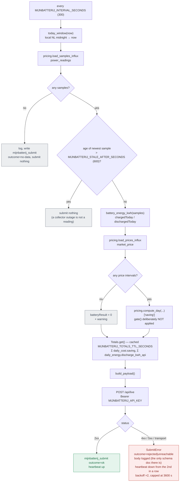

# mijnbatterij.nl submission flow

How one InfluxDB read becomes one public leaderboard row: what is refused, what is
sent, and which two fields are guesses about an undocumented API rather than
measurements. See DEPLOY.md, "Publishing to mijnbatterij.nl" for the operator's
side of this.

The service (`collector/mijnbatterij.py`) reads only InfluxDB. It never calls the
AlphaESS API, so it cannot perturb collection and adds nothing to the shared
`appId` rate budget.

## One submission cycle: `collect()` then `submit()`

Two refusals, both silent-failure guards rather than errors: a stale sample would
be published as live, and a missing price feed would be published as a real
€0.00 rather than an unknown one.

## Where each field comes from

| Payload field | Source | Note |
|---|---|---|
| `timestamp` | newest `power_readings` sample | the measurement's time, never the submission's |
| `batteryCharge` | `soc_percent` | |
| `batteryPower` | `battery_power_w` | **sign flipped by default.** AlphaESS `pbat` is + while discharging; sent charge-positive unless `MIJNBATTERIJ_CHARGE_POSITIVE=0` |
| `chargedToday` / `dischargedToday` | `battery_power_w` integrated from local midnight | via `pricing._accumulate`, so an interval that crosses zero lands in both totals instead of netting |
| `batteryResult` | `pricing.compute_day()['saving']` over today so far | the same two-world model `daily_cost` stores, ungated |
| `batteryResultTotal` | Σ stored `daily_cost.saving` at the current `model_version`, + today | |
| `totalBatteryCycles` | (Σ `daily_energy.discharge_kwh_api` + today) / `BATTERY_CAPACITY_KWH` + `MIJNBATTERIJ_CYCLES_OFFSET` | throughput-equivalent, not an event count |
| `mode` | `MIJNBATTERIJ_MODE` | a setting: the platform's bucketing of a DIY dispatcher is unverifiable from here |
| `loadBalancingActive` | `MIJNBATTERIJ_LOAD_BALANCING` | nothing in this stack does load balancing |

## Why `gate()` is not applied to today

`pricing.gate()` decides whether a day is trustworthy enough to **store
permanently** in `daily_cost`, and by construction a partial day fails its
coverage check — so applying it here would mean never submitting a euro figure at
all.

The bargain is different for a live value: today's number self-corrects on the
next cycle, five minutes later, and is superseded outright by the gated
`daily_cost` row tomorrow night. It is the same *model* either way, which is what
matters — a separate intraday model would make the platform's daily total step at
midnight by the difference between the two.

## Two known under-counts in `batteryResultTotal`

Both are deliberate: the total under-states rather than estimating.

- A day rejected by `pricing.gate()` is absent from `daily_cost` forever, and so
  from this sum. Filling it with an estimate would put a number on a public
  leaderboard that no stored row can ever be reconciled against.
- Yesterday is missing until `daily-savings.sh` runs (~02:00), so the total dips
  for the first couple of hours of each local day and then recovers.
