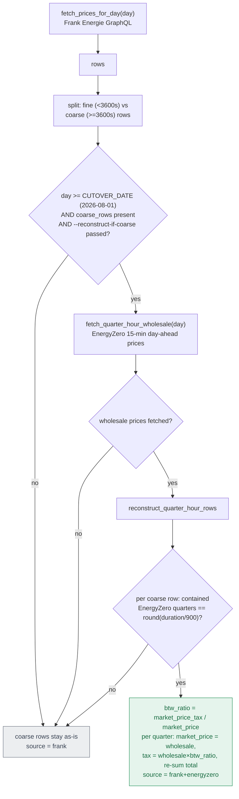
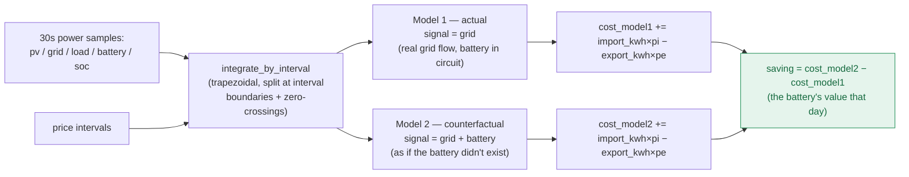
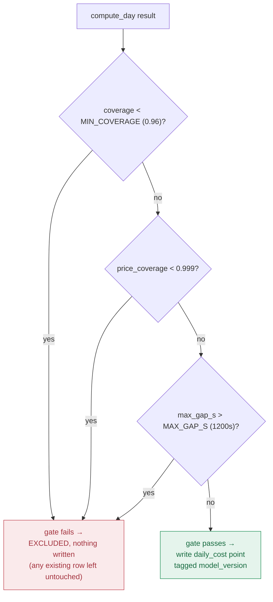
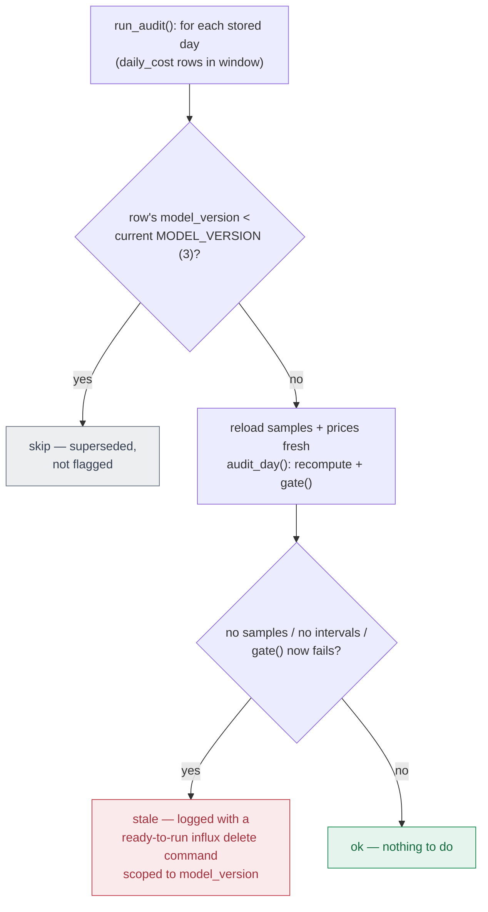

# Pricing / cost pipeline flow

How day-ahead prices and 30s power samples become a day's cost, the battery's savings
(Model 1 vs. Model 2), and the quality gate and audit that keep `daily_cost` honest over time.
See `DESIGN-battery-savings.md` for the conceptual model.

## Fetching prices: `prices.py`

Quarter-hour reconstruction only applies to coarse (hourly) rows, only on/after the cutover
date, and only when explicitly requested — mixed cutover-boundary days are left alone.

## Integrating cost: `compute_day()` in `pricing.py`

Both models integrate the same 30s power samples against the same price intervals
(`integrate_by_interval` — trapezoidal, split at interval boundaries and sign zero-crossings);
they differ only in which signal stands for "grid flow."

`pi` (import price) = `interval.total`. `pe` (export price, 2026 saldering) =
`market_price + market_price_tax + energy_tax` — the market price with the taxes refunded, and
no sourcing markup on either side of it. The markup is charged for sourcing energy, so it does
not arise on energy that was not sourced; `pi − pe` is therefore exactly one markup, not two.

## Quality gate: `gate()`

Checked in this order — price coverage before max-gap, deliberately: a partially-priced day is
*wrong*, not merely *thin*.

## Reconciliation: `audit_day()` / `run_audit()`

Catches rows written under old data or old rules that a plain rerun won't fix — `process_day`
silently leaves an already-written day untouched even if it would now fail the gate.

Nothing is deleted automatically — the operator runs the logged `influx delete` command, then
reruns `pricing.py` for those days.

## CLI entry points

| File | Flags | Effect |
|---|---|---|
| `prices.py` | `--date` \| `--backfill START END` (default: yesterday/today/tomorrow NL), `--dry-run`, `--reconstruct-if-coarse` | fetches and writes price intervals |
| `pricing.py` | `--date` \| `--backfill` (default: yesterday), `--csv PATH` (offline validation, implies dry-run), `--dry-run`, `--force` (bypass already-done skip), `--audit` (read-only; all stored days if no date given) | computes and writes `daily_cost`, or audits existing rows |

## File map

| File | Role |
|---|---|
| `collector/prices.py` | Fetches day-ahead prices; quarter-hour reconstruction for coarse rows. |
| `collector/pricing.py` | `compute_day()`, `gate()`, `process_day()`, `audit_day()`, `run_audit()` — integration, cost, gate, reconciliation. |
