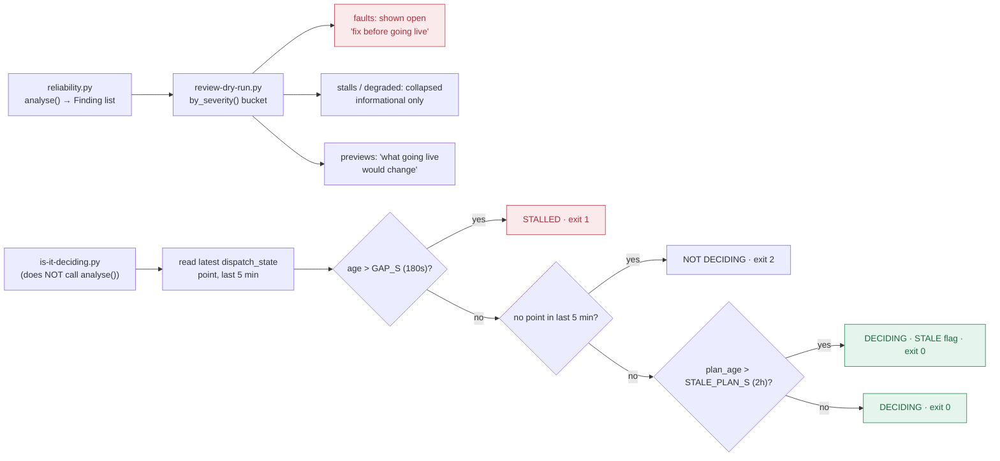

# Reliability judgement flow

How `dispatch/reliability.py` turns a day's dry-run ticks into a fault/preview/stall/degraded
verdict, and how that verdict is used to gate going live. Extracted from the dry-run report
page so both a human-facing report and an instant CLI check can share one judgement (see
`963e209` — "move the reliability judgement out of the page that renders it").

## `analyse()` — the check cascade

`analyse(ticks, runs, battery, soc, soc_floor=10.0)` (`dispatch/reliability.py:200-282`) runs
six independent checks over the whole tick stream, in order. Each check appends zero or more
`Finding`s — later checks always run, they don't short-circuit on an earlier finding.

```mermaid
flowchart TD
    IN["analyse(ticks, runs, battery, soc, soc_floor=10%)"] --> C1
    C1{"find_gaps(ticks):<br/>tick-to-tick silence &gt; 180s (GAP_S)?"}
    C1 -- "yes, per gap" --> A1["attribute_gap(battery, t0, t1):<br/>hole = longest_hole(battery, ±120s pad)"]
    A1 --> A2{"hole &gt;= 150s (COLLECTOR_GAP_S)?"}
    A2 -- yes --> F1["Finding: gap · STALL<br/>(network-caused, upstream of dispatch)"]
    A2 -- no --> F2["Finding: gap · FAULT<br/>(dispatch-caused)"]
    C1 -- no gaps --> C2
    F1 --> C2
    F2 --> C2

    C2{"armed_ticks: any tick.action<br/>not in (None, 'no dispatch')?"}
    C2 -- yes --> F3["Finding: armed · FAULT<br/>(another process driving the registers)"]
    C2 -- no --> C3
    F3 --> C3

    C3{"per discharge run:<br/>min(soc) &lt; soc_floor?"}
    C3 -- yes --> F4["Finding: discharge_below_floor · FAULT"]
    C3 -- no --> C4
    F4 --> C4

    C4{"any tick: plan_age_s &gt; 7200s (2h)?"}
    C4 -- yes --> F5["Finding: stale_plan · FAULT"]
    C4 -- no --> C5
    F5 --> C5

    C5{"degraded_ticks: any tick.read_error?"}
    C5 -- yes --> F6["Finding: blind · DEGRADED<br/>(inverter unreadable, decided anyway)"]
    C5 -- no --> C6
    F6 --> C6

    C6["per run where action != self:<br/>actual_cp = mean battery power, charge-positive"]
    C6 --> C7{action == 'hold'?}
    C7 -- yes --> C7A{"abs(actual_cp) &gt;= 50W (IDLE_W)?"}
    C7 -- no --> C7B["wanted_sign = +1 charge / −1 discharge"]
    C7B --> C7C{"abs(actual_cp) &lt; 50W<br/>OR sign(actual_cp) != wanted_sign?"}
    C7A -- yes --> F7["Finding: divergence · PREVIEW<br/>(what going live would change)"]
    C7C -- yes --> F7
    C7A -- no --> OUT
    C7C -- no --> OUT
    F7 --> OUT

    OUT["list[Finding] → by_severity()<br/>fault / preview / stall / degraded<br/>(all 4 keys always present)"]

    classDef fault fill:#faeaeb,stroke:#c14350,color:#a3323d;
    classDef preview fill:#eceafc,stroke:#5b52c9,color:#4038a0;
    classDef stall fill:#faefdd,stroke:#b8790f,color:#8a5a0a;
    classDef degraded fill:#eceef0,stroke:#6b7280,color:#374151;
    class F2,F3,F4,F5 fault;
    class F1 stall;
    class F6 degraded;
    class F7 preview;
```

## Severity taxonomy

| Severity | Meaning | Findings |
|---|---|---|
| **fault** | Real bug in `dispatch/` — would block going live | gap (dispatch-caused), armed (another writer), discharge-below-floor, stale-plan |
| **preview** | Behavior change going live would cause, not a bug today | divergence |
| **stall** | Tick stream stopped upstream of the whole stack | gap (network-caused) |
| **degraded** | Loop alive but inverter unreadable — fail-safe, not damage | blind ticks |

Gap *causation* (network vs. dispatch, via `attribute_gap`) is separate from divergence's
charge/discharge/hold comparison — the two checks answer different questions ("did the tick
stream stop, and why" vs. "did the battery actually do what the plan said").

## Consumers

`review-dry-run.py` renders the whole-day report and treats it as the go-live gate; `is-it-
deciding.py` skips `analyse()` entirely for an instant single-point CLI check.

There is no explicit go-live boolean — the fault list being non-empty on the rendered page
*is* the block. `is-it-deciding.py` never touches `analyse()`/`decision_runs`; it only reuses
the shared constants (`FIELDS`, `GAP_S`, `STALE_PLAN_S`, `TICK_S`) for its own single-point check.

## File map

| File | Role |
|---|---|
| `dispatch/reliability.py` | `analyse()`, `decision_runs()`, `find_gaps()`, `attribute_gap()`, `armed_ticks()`, `degraded_ticks()`, `plan_age_s()`, `Finding`, `by_severity()`. |
| `scripts/review-dry-run.py` | Whole-day HTML/SVG report; renders findings by severity; implicit go-live gate. |
| `scripts/is-it-deciding.py` | Instant CLI check against the latest `dispatch_state` point only — no historical analysis. |
